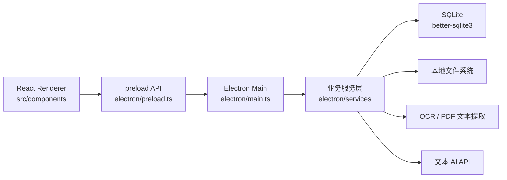
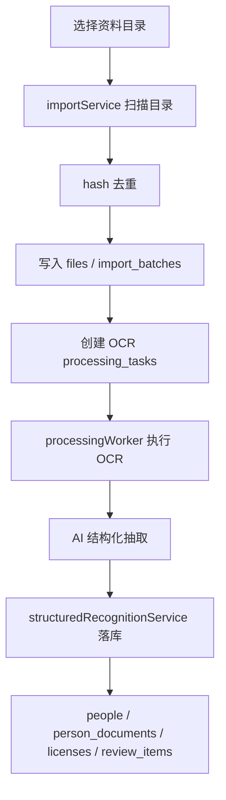
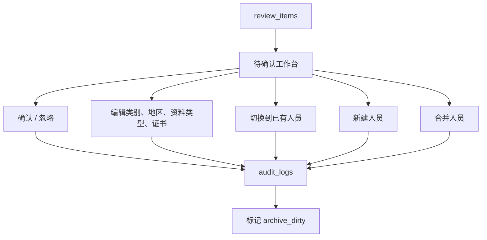
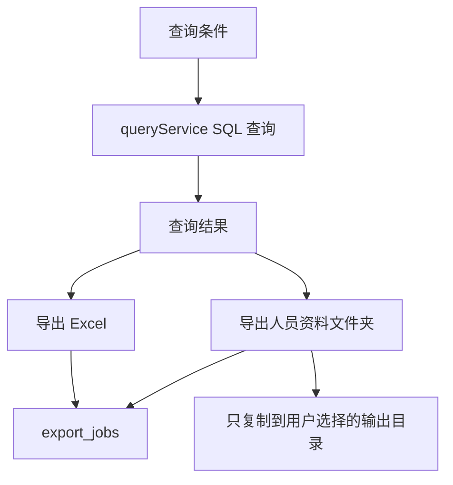
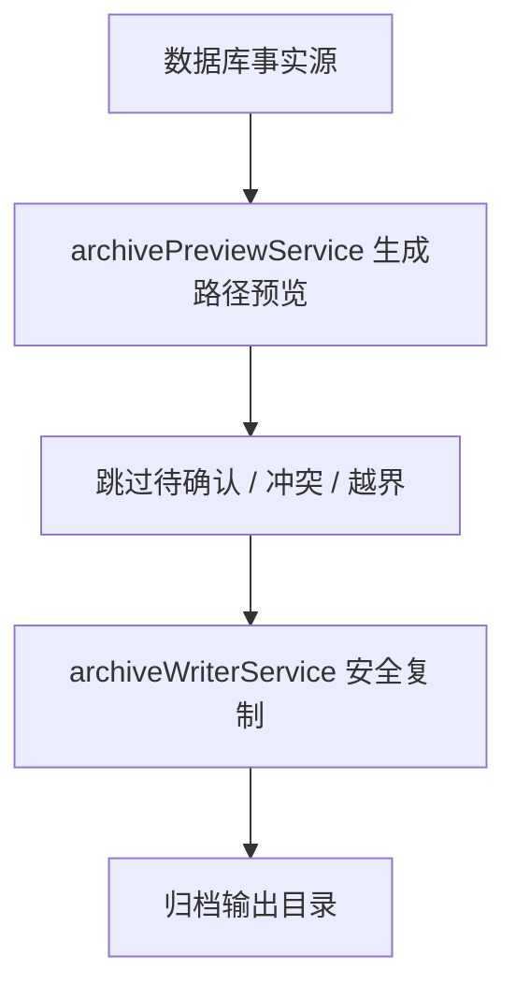

# Qualidex 项目架构

Qualidex 是一个 Windows 本地桌面应用，用 Electron 承载本地能力，用 React 提供工作台界面，用 SQLite 作为事实源。核心原则是：原始资料目录只读，数据库是事实源，归档和导出目录都是基于数据库生成的输出。

## 技术栈

- Electron：桌面壳、文件系统能力、IPC、对话框。
- electron-vite：主进程、preload、renderer 构建。
- React + TypeScript：前端工作台。
- SQLite + better-sqlite3：本地结构化数据存储。
- sqlite-vec：后续向量能力预留。
- 本地 OCR / PDF 文本提取：图片和 PDF 的文字读取。
- 云端文本 AI API：结构化抽取建议，不做最终裁决。
- xlsx：Excel 导出。

## 顶层目录

```text
electron/
  db/
  services/
  main.ts
  preload.ts
src/
  components/
  mock/
  App.tsx
  App.css
scripts/
docs/
test-fixtures/
```

## 运行时分层



## Renderer 层

位置：

- `src/App.tsx`
- `src/components/AppShell.tsx`
- `src/components/CommandBar.tsx`
- `src/components/Sidebar.tsx`
- `src/components/MainWorkspace.tsx`
- `src/App.css`

职责：

- 展示单页工作台。
- 管理首页、查询、导入、待确认、导出几个 workspace。
- 只调用 `window.qualidex` 暴露的 typed API。
- 不直接调用 Node 文件系统 API。
- 不直接访问 SQLite。

当前主要页面：

- 首页：入口和概览。
- 查询：真实条件输入、SQL 查询结果、查询导出入口。
- 导入：选择资料目录、导入、刷新任务、处理任务队列。
- 待确认：待确认列表、字段编辑、人员切换、新建人员、人员合并。
- 导出：归档预览、归档生成、导出提示。

## Preload 层

位置：

- `electron/preload.ts`

职责：

- 通过 `contextBridge.exposeInMainWorld` 暴露 `window.qualidex`。
- 把 renderer 的调用转成 IPC。
- 保持 renderer 和 Node 能力隔离。

示例能力：

- `scanDirectory`
- `runProcessingBatch`
- `listReviewItems`
- `updateReviewFields`
- `queryPeople`
- `exportQueryResultsExcel`
- `exportQueryResultFiles`
- `writeArchive`
- `cleanupArchiveOutput`

## Main Process 层

位置：

- `electron/main.ts`

职责：

- 创建 Electron 窗口。
- 打开 SQLite 数据库。
- 注册 IPC handler。
- 调用 services 层完成业务动作。
- 处理系统对话框，例如选择资料目录、选择导出目录、选择 Excel 保存位置。

数据库文件位于 Electron `userData/data/qualidex.sqlite`。

## Services 层

位置：

- `electron/services/*`

核心服务：

- `fileScanner.ts`：递归扫描目录，过滤支持的文件类型。
- `hashService.ts`：计算 sha256，用于去重。
- `importService.ts`：导入批次、新增目录导入、重新扫描。
- `processingQueueService.ts`：任务队列 CRUD。
- `processingWorkerService.ts`：串行执行 OCR 和 AI 抽取任务。
- `textExtractService.ts`：PDF / 文档文本提取。
- `ocrService.ts`：图片 OCR 调用。
- `aiConfig.ts`：AI provider / model / key 配置读取。
- `aiExtractService.ts`：AI 结构化抽取。
- `structuredRecognitionService.ts`：把 AI 建议落到人员、资料、证书、待确认项。
- `reviewService.ts`：待确认、字段编辑、人员切换、新建人员、人员合并。
- `archivePreviewService.ts`：标准归档路径预览。
- `archiveWriterService.ts`：安全复制归档输出。
- `queryService.ts`：真实 SQL 查询人员。
- `exportService.ts`：识别验收 Excel、查询结果 Excel、查询资料导出。
- `recycleService.ts`：软删除、恢复、归档输出清理。

## 数据库层

位置：

- `electron/db/connection.ts`
- `electron/db/schema.ts`

主要表：

- `import_batches`：导入批次。
- `files`：原始文件登记和处理状态。
- `people`：人员主数据。
- `person_documents`：人员和文件的资料关联。
- `licenses`：证书结构化信息。
- `review_items`：待确认项。
- `ai_extract_results`：AI 抽取结果。
- `processing_tasks`：OCR / AI / archive 队列任务。
- `audit_logs`：人工修改和高风险操作日志。
- `export_jobs`：查询导出记录。
- `license_match_logs`：证书匹配日志预留。

关键规则：

- `people.primary_category` 用于归档主类别。
- 查询类别是多选，MVP 使用 `primary_category IN (...)`。
- `person_categories` 未来可扩展，当前不作为主链路。
- 普通删除必须软删除。
- 文件原始路径只读，不能移动、删除、覆盖。

## 主数据流

### 导入与处理



### 待确认与人员整理



### 查询与导出



### 归档



## 安全边界

- Renderer 不直接访问文件系统。
- Renderer 不直接访问 SQLite。
- 原始资料目录只读。
- 归档生成和查询资料导出都只复制文件。
- 默认不覆盖已有输出文件。
- 回收站清理只清理归档输出副本，不触碰原始资料。
- AI 只提供建议，最终查询和导出基于数据库中的结构化数据。

## 验证体系

验证脚本位于 `scripts/`。推荐主入口：

```powershell
pnpm run verify:p1
```

它会串联：

- 导入批次
- 处理队列
- AI 成功链路
- 结构化识别
- 归档预览与写入
- 待确认列表与操作
- 字段编辑
- 人员切换 / 新建 / 合并
- 查询导出与回收站
- lint
- build

注意：`verify:p1` 不包含 `verify:db`，因为 `verify:db` 会触发 `electron-rebuild`，当前机器环境下可能破坏 `better-sqlite3` native binding。

## 后续演进建议

- 把现有 verify 脚本逐步拆成单测和 Electron E2E。
- 继续清理低频页面和历史注释中的乱码。
- 查询页后续可接自然语言解析和证书候选确认。
- 回收站可增加独立 UI，而不是只保留服务层能力。
- 引入 migrations 目录，替代 `ensureColumn` 的轻量迁移方式。
